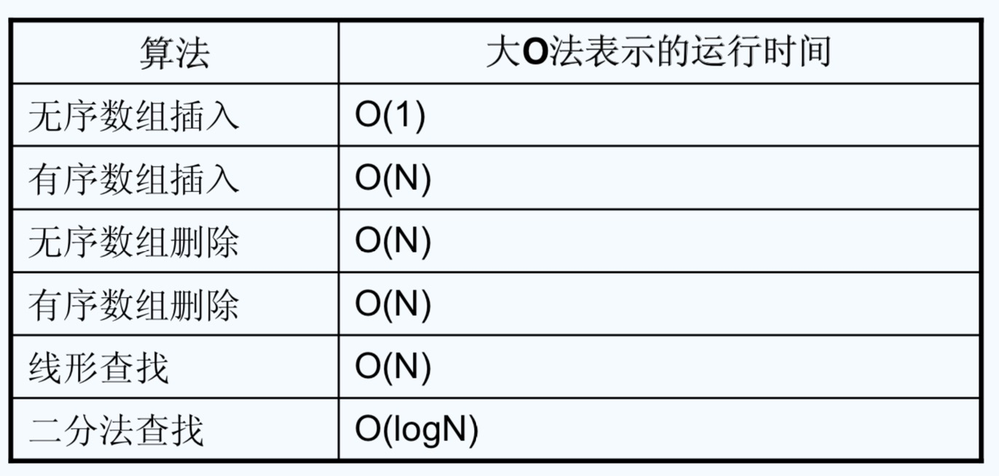

#### 数组是什么

数组是由相同类型的若干项数据组成的一个数据集合。也就是说数组是用来集合相同类型的对象并通过一个名称来引用这个集合，数组是引用类型。

#### 有序数组

数组中存放的数据是按照某种规则排过顺序的。优点就是增加了查询的效率，但是它并没有提高删除和插入元素的效率，因此，对于有序数组更适合用于查询的领域。
有序数组和无序数组的时间效率比较：

#### 数组排序
- 冒泡排序
  基本思路: 对未排序的各元素从头到尾依次比较相邻的两个元素是否逆序(与欲排顺序相反)，若逆序就交换这两元素，经过第一轮比较排序后可把最大(或)最小的
  元素排好，然后再用同样的方法把剩下的元素逐个进行比较，就得到所要的排序。
  效率：比较和交换次数都为O(N的平方)
  
- 选择排序
  基本思路：从所有的元素中找到最小(最大)元素放在排序序列的起始位置，然后再从未排序序列中继续寻找最小(最大)元素,
  然后放到已排序序列的末尾。以此类推，直到所有元素均排序完毕。
  
- 插入排序
  基本思路：通过构建有序序列，对于未排序序列，在已排序序列中从后向前扫描，找到相应位置插入。
  ，大致为N*(N-1)/4，所以这个算法比冒泡大致快一倍，比选择排序略快，尤其是部分数据已经局部有序的情况下，这个
  算法效率会更高
